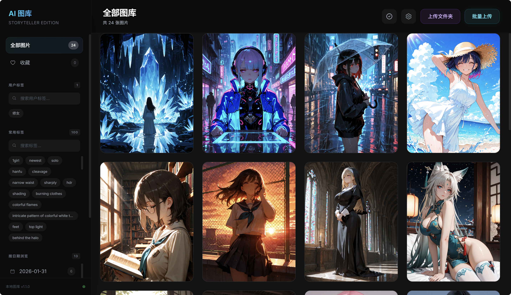
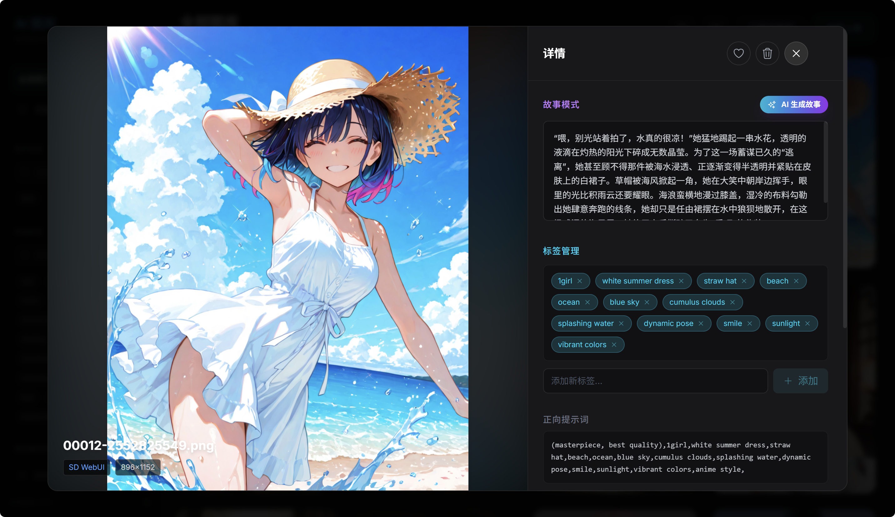

# AI Gallery & Storyteller

<div align="center">

**一个专为 AI 绘画爱好者设计的智能画廊与故事生成器**

基于 Google Gemini 视觉模型，自动为你的 AI 画作创作独特的微型故事

[](https://react.dev/)
[](https://www.typescriptlang.org/)
[](https://vitejs.dev/)
[](https://nodejs.org/)

</div>

## 截图  
  


---

## ✨ 核心功能

### 📤 智能上传系统
- **多种上传方式**
  - 🖱️ 拖拽上传：从文件管理器拖拽图片到页面任意位置
  - 📋 粘贴上传：复制图片后按 `Ctrl+V` 直接粘贴
  - 📁 批量上传：一次选择多个文件
  - 🗂️ 文件夹上传：直接上传整个文件夹
- **自动归档**：按修改日期自动归档到 `uploads/YYYY-MM-DD/` 文件夹
- **智能重命名**：自动处理文件名冲突，追加计数器

### 🤖 AI 故事生成
- **多模型支持**：支持 Google Gemini 和 OpenAI 兼容 API（包括 OpenRouter、DeepSeek、Moonshot 等）
- **灵活配置**：通过环境变量轻松切换 AI 服务提供商
- **内容过滤系统**
  - 年龄词汇自动过滤：移除 "16岁"、"18 year old" 等敏感词汇
  - 禁词替换表：可配置的词汇映射（如 "少女" → "美女"）
  - 智能降级策略：提示词被拦截时自动尝试仅用图片生成
- **可编辑故事**：支持手动编辑并保存生成的故事

### 🎨 图片管理
- **元数据解析**
  - ✅ ComfyUI 格式（JSON workflow）
  - ✅ SD WebUI 格式（parameters 文本）
  - 自动提取：Checkpoints、LoRAs、Prompts、Negative Prompts、Sampler 参数、图片尺寸
- **快速操作**
  - ⭐ 收藏功能：一键收藏喜欢的图片
  - 🗑️ 删除功能：删除图片及其数据库记录
  - 📊 详情查看：查看完整的生成参数和元数据

### 🏷️ 智能标签系统
- **双重标签**
  - 自动标签：从提示词中自动提取（可配置屏蔽列表）
  - 用户标签：手动添加个性化标签
- **标签管理**
  - 🔍 模糊搜索：快速查找标签
  - 🎯 标签筛选：点击标签查看相关图片
  - 📈 统计计数：显示每个标签的图片数量
- **屏蔽无意义标签**：过滤 "masterpiece"、"best quality" 等质量词汇

### 🔍 多维度浏览
- **按日期浏览**：查看特定日期上传的图片
- **按标签筛选**：自动标签和用户标签分组显示
- **按收藏筛选**：快速查看收藏的图片
- **实时计数**：显示每个筛选条件下的图片数量

### ⚙️ 设置管理
- **可视化配置界面**
  - 禁词替换表编辑器（表格式布局）
  - 标签屏蔽列表编辑器
  - 实时保存和验证
- **配置文件管理**
  - `config/forbidden-words.json`：词汇替换映射
  - `config/blocked-tags.json`：屏蔽标签列表

### 🚀 性能优化
- **虚拟滚动**：使用 `react-virtuoso`，只渲染可见区域的图片
- **无限滚动**：分页加载，默认每页 20 张图片
- **图片懒加载**：`loading="lazy"` + 骨架屏动画
- **智能缓存**：`React.memo` 避免不必要的组件重渲染
- **响应式布局**：自适应 1-4 列瀑布流布局

---

## 🛠️ 技术栈

### 前端
- **React 19** - 最新的 React 版本
- **Vite 6** - 极速的开发构建工具
- **TypeScript** - 类型安全的 JavaScript 超集
- **Tailwind CSS** - 实用优先的 CSS 框架
- **react-virtuoso** - 高性能虚拟滚动库

### 后端
- **Node.js + Express 5** - 服务器运行时和框架
- **SQLite** (better-sqlite3) - 轻量级嵌入式数据库
- **Multer** - 文件上传中间件
- **Google Gemini SDK** - AI 故事生成（默认）
- **OpenAI SDK** - 支持 OpenAI 兼容 API（可选）

---

## 🚀 快速开始

### 前置要求

- **Node.js** 18+ ([下载](https://nodejs.org/))
- **AI API Key** (二选一)：
  - **Google Gemini API Key** ([获取](https://aistudio.google.com/app/apikey)) - 免费，推荐
  - **OpenAI 兼容 API Key** - 如 OpenRouter ([获取](https://openrouter.ai/keys))、DeepSeek、Moonshot 等

### 安装步骤

#### 1. 克隆项目

```bash
git clone https://github.com/yourusername/AI-Gallery-Storyteller.git
cd AI-Gallery-Storyteller
```

#### 2. 安装依赖

```bash
npm install
```

#### 3. 配置环境变量

创建 `.env.local` 文件（不要提交到 Git）：

```bash
# Windows (CMD)
copy .env.local.example .env.local

# macOS/Linux
cp .env.local.example .env.local
```

编辑 `.env.local` 文件，填入你的配置：

```env
# ============================================
# 方案 1: 使用 Google Gemini (推荐，免费)
# ============================================
AI_PROVIDER=gemini
GEMINI_API_KEY=your_gemini_api_key_here

# ============================================
# 方案 2: 使用 OpenAI 兼容 API
# ============================================
# AI_PROVIDER=openai
# OPENAI_API_KEY=your_openai_api_key_here
# OPENAI_BASE_URL=https://openrouter.ai/api/v1  # OpenRouter 示例
# OPENAI_MODEL=openai/gpt-4o  # 或其他支持视觉的模型

# ============================================
# 服务器配置
# ============================================
# 服务器端口（可选，默认 3000）
PORT=3000

# 远程访问配置（可选，默认 false - 仅本地访问）
# 设置为 true 时，允许局域网内其他设备访问
ENABLE_REMOTE_ACCESS=false

# 代理设置（可选，用于访问国外 API）
# HTTPS_PROXY=http://127.0.0.1:7890
```

**配置说明：**

| 配置项 | 说明 | 默认值 | 示例 |
|--------|------|--------|------|
| `AI_PROVIDER` | AI 服务提供商 | `gemini` | `gemini` / `openai` |
| `GEMINI_API_KEY` | Google Gemini API 密钥 | - | `AIzaSyC...` |
| `OPENAI_API_KEY` | OpenAI 兼容 API 密钥 | - | `sk-or-v1-...` |
| `OPENAI_BASE_URL` | OpenAI API 端点地址 | `https://api.openai.com/v1` | `https://openrouter.ai/api/v1` |
| `OPENAI_MODEL` | 使用的模型名称 | `gpt-4o` | `openai/gpt-4o` |
| `PORT` | 服务器监听端口 | `3000` | `8080` |
| `ENABLE_REMOTE_ACCESS` | 是否允许远程访问 | `false` | `true` |

**AI Provider 选择指南：**

**1. Google Gemini (推荐)**
- ✅ 完全免费（每天 1500 次请求）
- ✅ 视觉分析能力强
- ✅ 支持中文
- ⚠️ 国内需要代理访问

**2. OpenRouter**
- ✅ 一个 API Key 支持多个模型
- ✅ 提供免费模型（如 `google/gemini-2.0-flash-exp:free`）
- ✅ 国内可直接访问（无需代理）
- ✅ 支持 GPT-4o、Claude、Gemini 等多种模型
- 💰 付费模型按使用量计费

**3. 其他 OpenAI 兼容服务**
- **DeepSeek**：国内服务，价格便宜
  ```env
  AI_PROVIDER=openai
  OPENAI_API_KEY=your_deepseek_key
  OPENAI_BASE_URL=https://api.deepseek.com
  OPENAI_MODEL=deepseek-chat
  ```
- **Moonshot (月之暗面)**：国内服务，长上下文
  ```env
  AI_PROVIDER=openai
  OPENAI_API_KEY=your_moonshot_key
  OPENAI_BASE_URL=https://api.moonshot.cn/v1
  OPENAI_MODEL=moonshot-v1-8k
  ```
- **本地 Ollama**：完全免费，本地运行
  ```env
  AI_PROVIDER=openai
  OPENAI_API_KEY=ollama  # 任意值即可
  OPENAI_BASE_URL=http://localhost:11434/v1
  OPENAI_MODEL=llava  # 支持视觉的模型
  ```

**远程访问配置详解：**

- **仅本地访问（默认）**：
  ```env
  ENABLE_REMOTE_ACCESS=false
  # 或不设置此项
  ```
  服务器仅监听 `127.0.0.1`，只能通过 `http://localhost:3000` 访问。

- **允许局域网访问**：
  ```env
  ENABLE_REMOTE_ACCESS=true
  ```
  服务器监听 `0.0.0.0`，局域网内其他设备可通过 `http://<your-local-ip>:3000` 访问。
  
  查看本机局域网 IP：
  ```bash
  # Windows
  ipconfig
  
  # macOS/Linux
  ifconfig
  ```

> ⚠️ **安全提示**：
> - `.env.local` 已在 `.gitignore` 中，请勿将此文件提交到 Git 仓库！
> - 启用远程访问时，请确保在可信任的网络环境中使用
> - 本应用未内置身份验证机制，启用远程访问意味着任何知道地址的人都可以访问
> - 建议仅在局域网内使用，避免暴露到公网

#### 4. 配置禁词表和屏蔽标签（可选）

如果需要自定义内容过滤规则，可以编辑配置文件：

```bash
# 编辑禁词替换表
notepad config\forbidden-words.json

# 编辑标签屏蔽列表
notepad config\blocked-tags.json
```

或者通过应用内的设置界面进行可视化编辑（推荐）。

#### 5. 启动开发服务器

```bash
npm run dev
```

服务器将在 `http://localhost:3000` 启动

#### 6. 构建生产版本

```bash
npm run build
npm start
```

---

## 🤖 AI 模型选择指南

本应用支持多种 AI 服务，你可以根据需求选择最合适的方案。

### 方案对比

| 服务 | 费用 | 国内访问 | 视觉能力 | 推荐场景 |
|------|------|----------|----------|----------|
| **Google Gemini** | 🆓 完全免费 | ⚠️ 需要代理 | ⭐⭐⭐⭐⭐ 优秀 | 有代理，追求质量 |
| **OpenRouter (Gemini Free)** | 🆓 免费模型可用 | ✅ 直连 | ⭐⭐⭐⭐⭐ 优秀 | 国内无代理用户 |
| **OpenRouter (GPT-4o)** | 💰 按量付费 | ✅ 直连 | ⭐⭐⭐⭐⭐ 优秀 | 追求稳定性 |
| **DeepSeek** | 💰 便宜 | ✅ 直连 | ⭐⭐⭐ 一般 | 预算有限 |
| **Moonshot** | 💰 中等 | ✅ 直连 | ⭐⭐⭐ 一般 | 需要长上下文 |
| **本地 Ollama** | 🆓 完全免费 | ✅ 本地 | ⭐⭐ 较弱 | 注重隐私 |

### 推荐配置

#### 🥇 最佳选择：Google Gemini（有代理）

```env
AI_PROVIDER=gemini
GEMINI_API_KEY=your_gemini_api_key_here
HTTPS_PROXY=http://127.0.0.1:7890
```

**优点**：
- 完全免费，每天 1500 次请求
- 视觉分析能力最强
- 原生支持中文

#### 🥈 国内最佳：OpenRouter + 免费 Gemini

```env
AI_PROVIDER=openai
OPENAI_API_KEY=sk-or-v1-xxxxx
OPENAI_BASE_URL=https://openrouter.ai/api/v1
OPENAI_MODEL=google/gemini-2.0-flash-exp:free
```

**优点**：
- 无需代理，直接访问
- 使用 OpenRouter 的免费 Gemini 模型
- 一个账号可切换多个模型

**获取 API Key**：
1. 访问 [OpenRouter](https://openrouter.ai/)
2. 注册并登录
3. 进入 [Keys 页面](https://openrouter.ai/keys) 创建 API Key
4. 复制密钥到 `.env.local`

#### 💰 付费稳定：OpenRouter + GPT-4o

```env
AI_PROVIDER=openai
OPENAI_API_KEY=sk-or-v1-xxxxx
OPENAI_BASE_URL=https://openrouter.ai/api/v1
OPENAI_MODEL=openai/gpt-4o
```

**价格参考**（通过 OpenRouter）：
- GPT-4o: ~$2.5 / 1M tokens（约 200 张图片生成故事）
- Claude 3.5 Sonnet: ~$3 / 1M tokens
- Gemini 1.5 Pro: ~$1.25 / 1M tokens

### OpenRouter 可用模型列表

访问 [OpenRouter Models](https://openrouter.ai/models) 查看完整列表，支持视觉的热门模型：

- `google/gemini-2.0-flash-exp:free` - 免费，推荐
- `openai/gpt-4o` - 高质量，付费
- `anthropic/claude-3.5-sonnet` - 长文本，付费
- `google/gemini-pro-1.5` - 平衡，付费

### 本地部署方案（完全免费）

使用 Ollama 在本地运行模型，无需联网，完全隐私：

**1. 安装 Ollama**
```bash
# Windows: 下载安装程序
# https://ollama.ai/download

# macOS
brew install ollama

# Linux
curl -fsSL https://ollama.ai/install.sh | sh
```

**2. 下载支持视觉的模型**
```bash
ollama pull llava
```

**3. 配置 .env.local**
```env
AI_PROVIDER=openai
OPENAI_API_KEY=ollama
OPENAI_BASE_URL=http://localhost:11434/v1
OPENAI_MODEL=llava
```

**注意**：本地模型的视觉分析能力相对较弱，生成质量不如云端服务。

---

## 📖 使用指南

### 上传图片

**方式一：拖拽上传**
1. 从文件管理器选择图片
2. 拖拽到浏览器窗口的任意位置
3. 释放鼠标完成上传

**方式二：粘贴上传**
1. 复制图片（截图、网页图片等）
2. 在页面任意位置按 `Ctrl+V`（或 `Cmd+V`）
3. 自动开始上传

**方式三：批量上传**
- 点击右上角的"批量上传"按钮
- 选择多个图片文件
- 点击"打开"完成上传

**方式四：文件夹上传**
- 点击右上角的"上传文件夹"按钮
- 选择包含图片的文件夹
- 自动批量上传文件夹内的所有图片

### 生成故事

1. 点击任意图片打开详情页
2. 点击"AI 生成故事"按钮
3. 等待 Gemini 分析图片并生成故事（约 3-5 秒）
4. 故事自动保存，可随时编辑

### 管理标签

**查看标签**
- 左侧边栏显示"常用标签"（自动提取）和"用户标签"（手动添加）
- 每个标签旁显示包含该标签的图片数量

**添加标签**
1. 打开图片详情页
2. 在"标签管理"区块的输入框中输入标签名
3. 按 `Enter` 或点击"添加"按钮
4. 标签立即添加到图片和侧边栏

**删除标签**
- 在详情页的标签列表中，点击标签旁的 `×` 按钮

### 筛选与浏览

**按日期浏览**
- 左侧边栏"按日期浏览"区域显示所有日期文件夹
- 点击日期查看该日期上传的图片

**按标签筛选**
- 在侧边栏的标签列表中点击任意标签
- 主界面显示包含该标签的所有图片

**按收藏筛选**
- 点击侧边栏的"收藏"选项
- 查看所有收藏的图片

**查看全部**
- 点击侧边栏的"全部图片"
- 返回无筛选状态

### 配置设置

1. 点击右上角的设置图标 ⚙️
2. 在"禁词替换表"标签页：
   - 添加、编辑或删除词汇映射
   - 例如：`"少女" → "美女"`
3. 在"标签屏蔽列表"标签页：
   - 添加或删除需要屏蔽的标签
   - 例如：`masterpiece`, `best quality`
4. 点击"保存设置"应用更改
5. 刷新页面后生效（禁词表仅对新生成的故事有效）

---

## 📁 项目结构

```
AI-Gallery-Storyteller/
├── components/              # React 组件
│   ├── Sidebar.tsx         # 侧边栏导航
│   ├── DetailModal.tsx     # 图片详情模态框
│   ├── ImageCard.tsx       # 图片卡片组件
│   ├── VirtualMasonryGallery.tsx  # 虚拟瀑布流
│   ├── SettingsModal.tsx   # 设置管理界面
│   └── Icons.tsx           # 图标组件库
├── server/                  # 后端服务
│   ├── index.ts            # Express 服务器入口
│   ├── db.ts               # SQLite 数据库操作
│   ├── metadata.ts         # 图片元数据解析
│   └── organizer.ts        # 文件整理与同步
├── services/                # 前端服务
│   ├── geminiService.ts    # Gemini API 调用
│   ├── openaiService.ts    # OpenAI 兼容 API 调用
│   └── imageParser.ts      # 图片解析逻辑
├── config/                  # 配置文件目录
│   ├── forbidden-words.json      # 禁词替换表
│   ├── forbidden-words.example.json
│   ├── blocked-tags.json         # 标签屏蔽列表
│   ├── blocked-tags.example.json
│   └── README.md           # 配置文件说明
├── docs/                    # 文档目录
│   ├── CONTENT_FILTERING.md      # 内容过滤机制说明
│   ├── DRAG_DROP_UPLOAD.md       # 拖拽上传功能文档
│   ├── IMPLEMENTATION_SUMMARY.md # 功能实施总结
│   └── OPTIMIZATION_SUMMARY.md   # 性能优化文档
├── db/                      # 数据库文件（自动生成）
│   └── images.db           # SQLite 数据库
├── uploads/                 # 图片存储目录（自动生成）
│   ├── 2026-01-30/         # 按日期归档
│   ├── 2026-01-29/
│   └── ...
├── .env.local              # 环境变量（不提交到 Git）
├── .env.local.example      # 环境变量示例
├── App.tsx                 # 主应用入口
├── index.html              # HTML 模板
├── index.tsx               # React 入口
├── types.ts                # TypeScript 类型定义
├── constants.ts            # 常量定义
├── vite.config.ts          # Vite 配置
├── tsconfig.json           # TypeScript 配置
└── package.json            # 项目依赖
```

---

## 📚 API 文档

详细的 API 参考文档请查看：[docs/API_REFERENCE.md](docs/API_REFERENCE.md)

### 主要 API 端点

| 端点 | 方法 | 描述 |
|------|------|------|
| `/api/images` | GET | 获取图片列表（支持分页和筛选） |
| `/api/images/:id` | DELETE | 删除图片 |
| `/api/images/:id/story` | PATCH | 更新图片故事 |
| `/api/images/:id/favorite` | PATCH | 更新收藏状态 |
| `/api/images/:id/tags` | GET/POST/DELETE | 管理图片标签 |
| `/api/tags` | GET | 获取标签列表 |
| `/api/folders` | GET | 获取日期文件夹列表 |
| `/api/upload` | POST | 上传图片 |
| `/api/settings/forbidden-words` | GET/PUT | 管理禁词表 |
| `/api/settings/blocked-tags` | GET/PUT | 管理屏蔽标签 |

---

## 🐛 故障排除

详细的故障排除指南请查看：[docs/TROUBLESHOOTING.md](docs/TROUBLESHOOTING.md)

### 常见问题

**Q: 如何选择 AI 服务？**
- A: 参考上方的"AI 模型选择指南"。有代理推荐 Gemini，国内无代理推荐 OpenRouter。

**Q: OpenRouter 的免费模型有限制吗？**
- A: 免费模型有速率限制（约 20 次/分钟），适合个人使用。如需更高频率，可升级到付费模型。

**Q: Gemini API 返回 "PROHIBITED_CONTENT" 错误**
- A: 这是因为提示词包含敏感内容。系统会自动尝试仅用图片生成，如果仍失败，请手动编辑禁词表或切换到 OpenRouter。

**Q: OpenAI API 返回 401 错误**
- A: API Key 无效或已过期，请检查 `.env.local` 中的 `OPENAI_API_KEY` 配置。

**Q: 国内无法连接 Gemini API**
- A: 需要配置代理，或切换到 OpenRouter（无需代理）。

**Q: 上传的图片无法解析元数据**
- A: 确保图片是从 ComfyUI 或 SD WebUI 生成的 PNG 格式，且包含元数据。

**Q: 虚拟滚动不流畅**
- A: 检查是否打开了过多的浏览器标签页，尝试减少同时运行的应用程序。

**Q: 数据库锁定错误**
- A: 关闭所有使用数据库的进程，删除 `db/images.db-wal` 和 `db/images.db-shm` 文件后重启。

---

## 🔒 安全注意事项

### API Key 保护

1. **永远不要提交 `.env.local` 文件**
   - 该文件已在 `.gitignore` 中
   - 包含你的 Gemini API Key，泄露可能导致配额滥用

2. **定期轮换 API Key**
   - 在 [Google AI Studio](https://aistudio.google.com/app/apikey) 中定期更新 API Key
   - 如果怀疑泄露，立即撤销并生成新的 Key

3. **使用环境变量**
   - 生产环境部署时使用系统环境变量
   - 不要在代码中硬编码 API Key

### 数据安全

- **本地存储**：所有数据存储在本地 SQLite 数据库，不上传到任何服务器
- **备份建议**：定期备份 `db/` 和 `uploads/` 目录
- **隐私保护**：敏感图片建议使用私有部署，不要在公共服务器上运行

---

## 🗺️ 开发路线图

查看详细的功能规划：[todo.md](todo.md)

### 下一版本计划 (v1.3.0)

- [ ] 批量操作功能（批量删除、批量标签、批量生成故事）
- [ ] 搜索增强（全文搜索故事内容、组合筛选）
- [ ] 数据导出（导出为 ZIP、CSV、Markdown）

### 未来功能

- [ ] 数据统计仪表板（图表、趋势分析）
- [ ] 图片编辑功能（裁剪、旋转、滤镜）
- [ ] 主题定制（浅色/深色模式切换）
- [ ] 多语言支持（英文、日文）

---

## 🤝 贡献

欢迎提交 Issue 和 Pull Request！

### 开发指南

1. Fork 本仓库
2. 创建你的特性分支 (`git checkout -b feature/AmazingFeature`)
3. 提交你的更改 (`git commit -m 'feat: add some amazing feature'`)
4. 推送到分支 (`git push origin feature/AmazingFeature`)
5. 打开一个 Pull Request

### Commit 规范

遵循 [Conventional Commits](https://www.conventionalcommits.org/) 规范：

- `feat:` 新功能
- `fix:` Bug 修复
- `docs:` 文档更新
- `style:` 代码格式调整
- `refactor:` 代码重构
- `perf:` 性能优化
- `test:` 测试相关
- `chore:` 构建/工具相关

---

## 📄 许可证

[MIT License](LICENSE)

---

## 🙏 致谢

- [React](https://react.dev/) - 用户界面库
- [Vite](https://vitejs.dev/) - 前端构建工具
- [Google Gemini](https://ai.google.dev/) - AI 故事生成
- [react-virtuoso](https://virtuoso.dev/) - 虚拟滚动组件
- [Tailwind CSS](https://tailwindcss.com/) - CSS 框架

---

<div align="center">

**如果这个项目对你有帮助，请给它一个 ⭐ Star！**

Made with ❤️ by AI Gallery Contributors

</div>
